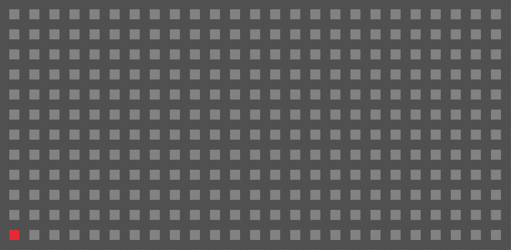
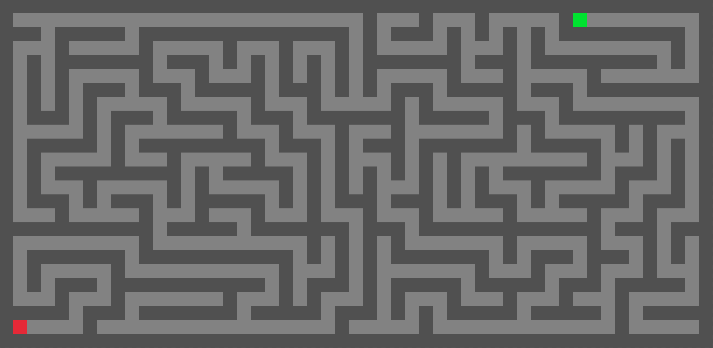

# C Maze Generation

## About

This repository contains the source code for our Maze generation extension for the Imperial Y1 C Project. Using C and the Raylib game engine, we have implemented 3 maze generation algorithm visualisations, **Randomised Prim's**, **Randomised Kruskal's** and **Recursive Backtracking**, as well as **Dijkstra's pathfinding algorithm**.

## Examples

Prim's Algorithm:


Kruskal's Algorithm:


Dijkstra's Algorithm:


## Getting Started

These instructions will get you a copy of the project up and running on your local machine for development and testing purposes.

### Prerequisites

Ensure that you have the following prerequisites installed:

* gcc - [Download and install version 9.3.0 +](https://gcc.gnu.org/)
* make - [Download and install version 4.2.1 +](https://www.gnu.org/software/make/)

A compatible Raylib version is included in the repository. Please note that the Makefile only provides compilation instructions for Linux, WSL and MacOS. Manual generation of the Raylib `librarylib.a` file may be required.

### Installation

Firstly clone the repository:

``` bash
git clone https://github.com/ethanrange/c-maze-generation.git
```

The main program then may be compiled with make in `src`:

```bash
cd src
make
/bin/main
```

Units tests may be compiled and run with:

```bash
cd testsuite
make test
```

## Usage

The maze starts in a blank uninitialised state. Left click any tile to convert it to a goal tile. Dijkstra's algorithm will find the path to the cloest goal tile from the player.

### **Player Controls**

| Control                                             | Action          |
|-----------------------------------------------------|-----------------|
| <kbd>W</kbd> <kbd>A</kbd> <kbd>S</kbd> <kbd>D</kbd> | Player Movement |
| Left Mouse                                          | Create Goal     |

### **Algorithm Controls**

| Control                         | Action                  |
|---------------------------------|-------------------------|
| <kbd>P</kbd>                    | Run Prims               |
| <kbd>K</kbd>                    | Run Kruskals            |
| <kbd>B</kbd>                    | Run Recursive Backtrack |
| <kbd>D</kbd>                    | Run Dijkstras           |
| <kbd>Shift</kbd> + <kbd>P</kbd> | Step Prims              |
| <kbd>Shift</kbd> + <kbd>K</kbd> | Step Kruskals           |
| <kbd>Shift</kbd> + <kbd>D</kbd> | Step Dijkstras          |

### **Miscellaneous Controls**

| Control                   | Action       |
| -----------               | -----------  |
| <kbd>T</kbd> | Print Test Summary

## License

This project is licensed under the MIT License - see the [LICENSE.md](LICENSE.md) file for details
